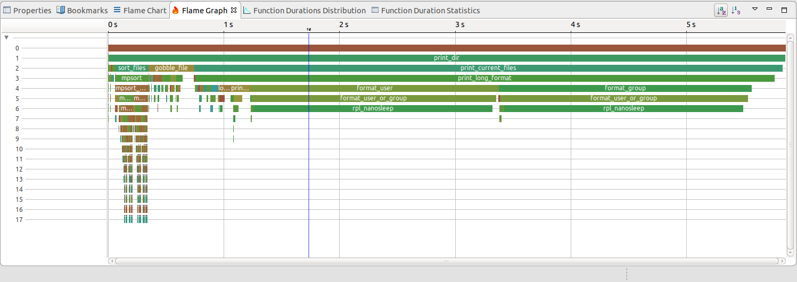
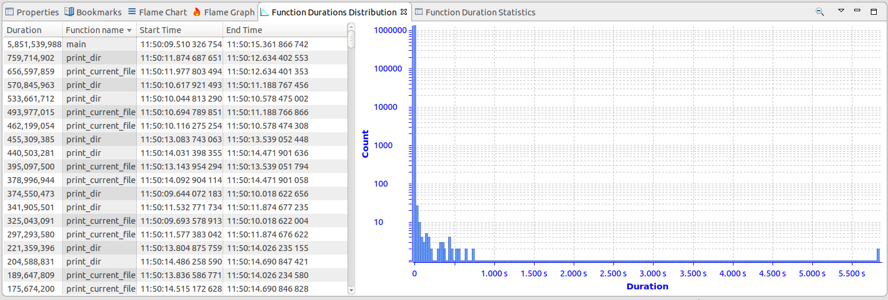
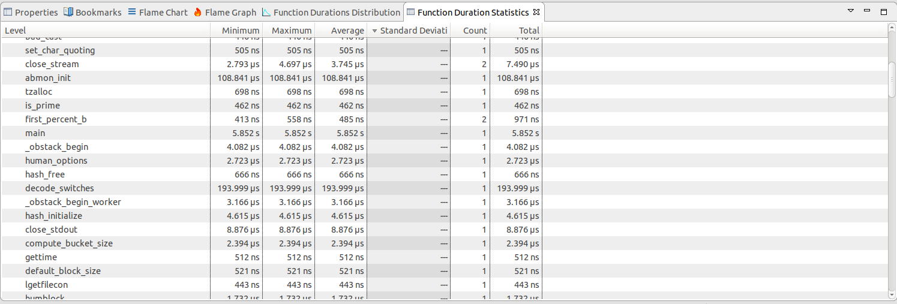

### Instrumenting C/C++ function calls

In this lab, you will learn to compile, trace and analyze C/C++ programs. The objective is to find functions that can be improved and lead to optimisations that saves time and resources during execution.

*Pre-requisites*: Have Trace Compass installed and opened. Have git, lttng and the callstack add-on on Trace Compass installed. You can follow the [Installing TraceCompass](00-installing-tracecompass.md) lab or read the [TraceCompass web site](https://tracecompass.org) for more information.

- - -

#### Sub-task 1: Tracing `ls` from coreutils

In this lab you will use the coreutils package to compile and trace the `ls` command. In order to do that we need the source code for this package which can be download with git:
```bash
git clone git://git.sv.gnu.org/coreutils
```
After cloning this repository we need to change the `src/ls.c` source file in order to introduce an overhead. In the lab folder, there is a modified version of the `ls.c` file. You can replace the `src/ls.c` with the one provided in this tutorial.

Then you will need to compile the modified version of `ls` by running these commands in coreutils/:

```bash
$ ./bootstrap
$ ./configure CFLAGS="-g -O2 -finstrument-functions"
$ make
```
[clang](https://linux.die.net/man/1/clang) and [gcc](https://linux.die.net/man/1/gcc) have the flag `-finstrument-functions` which generates instrumentation calls for entry and exit to functions. A more detailed explaination can be found [here](https://lttng.org/docs/v2.10/#doc-liblttng-ust-cyg-profile). Then after compiling coreutils the `ls` executable is located in `coreutils/src/`.
You can generate the trace using the following command in `coreutils/`:
```bash
$ lttng-record-trace -p cyg_profile ./src/ls -lR
```

- - -

#### Sub-task 2: Visualizing cyg profile traces

In the previous sub-task, you generated a trace of the `ls` command that contains all the function calls. You can open this trace on Trace Compass and you should see in the *Project Explorer View*, under Views, the *LTTng-UST CallStack* tree view. Under this, four views are present:

* The *Flame Chart View* shows the stack state with respect to time, you can then see when a function is executed, how much time it took and what function called it.


* The *Flame Graph View* looks similar to the *Flame Chart View* but it is different. Each box represents a function in the stack but the difference is that the horizontal axis show the total aggregated duration of all calls of this function at a particular level. A more complete explaination is available [here](http://www.brendangregg.com/FlameGraphs/cpuflamegraphs.html#Description).



* The *Function Durations Distribution View* is a bar graph that shows the number of function calls with respect to their duration. The count is using a logarithmic scale. In this example it shows that very few functions takes longer than 0.5 seconds.



* The *Function Duration Statistics View* is a table with each function's minimum, maximum, average duration and other statistical parameters that may show that in certain cases, the duration can be bigger or lower depending on the context. In this case `print_dir` can take a long time to execute depending on the size of the directory.



We can easily see in the *Flame Graph View* that the function `format_user_or_group` takes the most time in the execution. We also see that it is a call to the `nanosleep` function that represents most of this wasted time.

- - -

#### Conclusion

In the lab, you have compiled a program with tracing helpers, traced the `ls` command and saw all the *LTTng-UST CallStack* views. With the help of Trace Compass you learned to quickly analyze the trace and profile a C/C++ application in order to optimize the bottleneck of the program.


